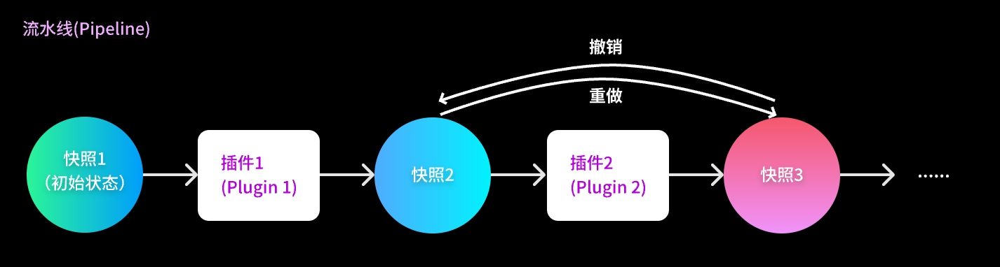

# TuneFlow Typescript SDK

[English](./README.md) | [中文](./README.zh.md)


## `TuneFlow` 是什么?

[TuneFlow](https://www.tuneflow.com) 是AI驱动的新一代DAW (数字音乐工作站)。与传统DAW不同的是，与它深度集成的插件系统可以支持端到端的完整音乐制作流程，比如**作曲**, **编曲**, **自动化**, **混音**, **转录** 等等...... 你可以轻松地将你的音乐算法或AI模型集成到TuneFlow中，所有的更改会即时反映到DAW中，与你的日常制作流程融为一体。

## 安装

``` bash
npm install tuneflow
```

## 使用别的编程语言?

以下是为其他编程语言开发的SDK:

* **Python**: https://www.github.com/tuneflow/tuneflow-py
* 其他: 欢迎贡献第三方SDK!

## 快速开始

TuneFlow插件系统的核心宗旨是让开发者只需要关注数据模型，而无需关注底层的各种实现。换句话说，一个TuneFlow插件的唯一使命就是按照自己的需求去修改当前曲目的数据模型。插件运行完成后，TuneFlow会自动检测被更改的部分，并对当前工程做出相应的调整。以下是插件运行流程的示意图：



一个最简单的TuneFlow插件可能看起来是这样的:

``` typescript
import type { LabelText, ParamDescriptor, SliderWidgetConfig, Song } from 'tuneflow';
import { TuneflowPlugin, WidgetType } from 'tuneflow';

export class HelloWorld extends TuneflowPlugin {
  static providerId(): string {
    return 'andantei';
  }

  static pluginId(): string {
    return 'hello-world';
  }

  static providerDisplayName(): LabelText {
    return 'Andantei行板';
  }

  static pluginDisplayName(): LabelText {
    return 'Hello World 插件';
  }

  params(): { [paramName: string]: ParamDescriptor } {
    return {
      ......
    };
  }

  async init(song: Song, readApis: ReadAPIs): Promise<void> {
    ......
  }

  async run(song: Song, params: { [paramName: string]: any }): Promise<void> {
    ......
  }
}

```

编写TuneFlow插件时，我们主要关注的对象是`params`, `init` 和 `run`三个方法.

### `params`

这个方法的返回值向DAW表明我们的插件需要哪些输入参数，这些参数可能从用户那里获取，也可能从DAW本身获取。你只需要指定每个参数的名称，介绍，和UI组件(Widget)，TuneFlow会自动根据这些配置生成UI。

### `init`

这个方法会在用户加载插件但还没有执行插件的时候被调用。它的作用是让你能够根据当前的歌曲数据和其他相关信息对插件进行初始化，并对需要输入的参数等做出相应的调整。

比如，你有一个风格预设的列表，有的预设只适合3/4拍，有的适合4/4拍。这个时候你可以在`init`中读取歌曲当前的拍号，然后把预设列表中不适合当前拍号的预设过滤掉，这样用户在选择的时候不会选到不适合当前曲目的预设。

这个方法有两个输入参数：
* `song: Song` 当前歌曲的快照
* `readApis: ReadAPIs` 只读的API接口，可用于读取当前的音频插件列表，获取音频数据等。

### `run`

这个方法在用户实际执行插件(按下**启用**按钮)时被调用。你需要在这里实现本插件的核心执行逻辑。它有三个输入参数：

* `song: Song` 当前歌曲的快照
* `params: { [paramName: string]: any }` 根据`params()`提供的参数列表收集到的用户或DAW提供的实际参数值，每一个key对应`params()`中指定的参数名，value则是用户或DAW提供的实际参数值。
* `readApis: ReadAPIs` 只读的API接口，可用于读取当前的音频插件列表，获取音频数据等。

## 示例

学习编写TuneFlow插件最好的方式就是阅读现有的插件代码。以下代码仓库中包含了绝大部分用于TuneFlow内部编辑器的插件： https://www.github.com/tuneflow/tuneflow-plugin-basic


## 更多资源

[TuneFlow 官网](https://tuneflow.com)

[TuneFlow开发者文档](https://help.tuneflow.com/zh/developer)

[Python 插件 SDK](https://www.github.com/tuneflow/tuneflow-py)